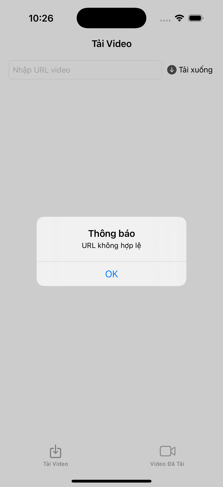
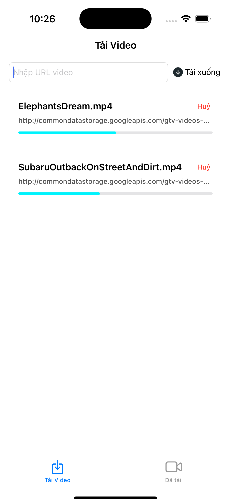
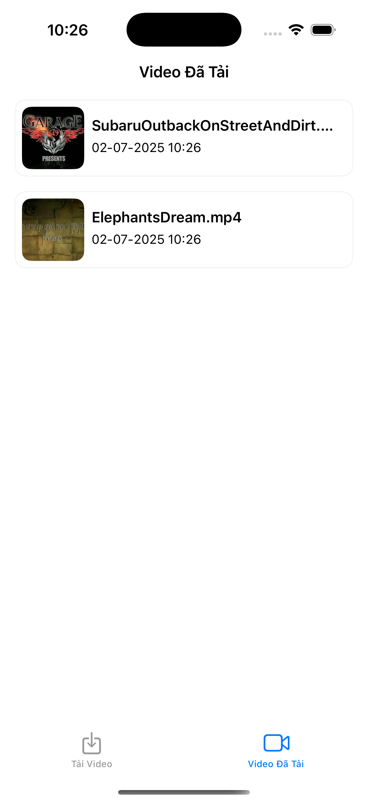
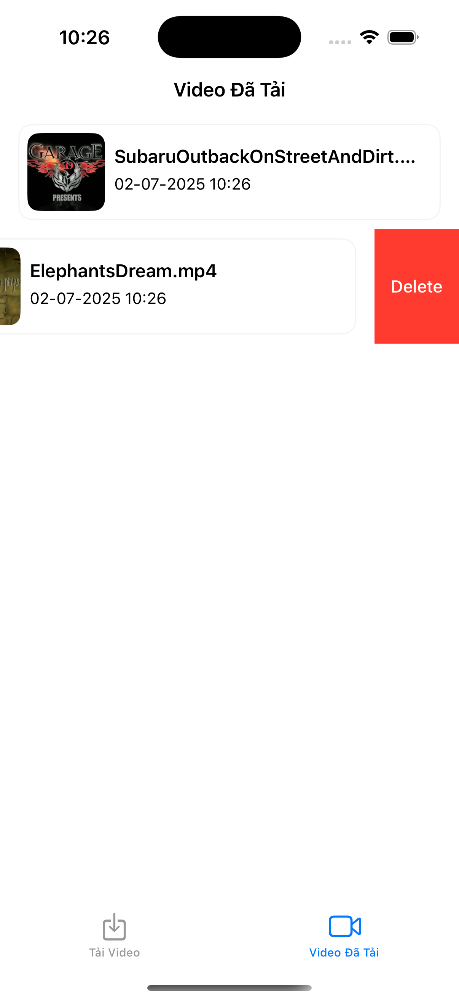

# 📥 iOS Video Downloader

Ứng dụng iOS cho phép người dùng **tải video từ URL**, theo dõi tiến trình tải, huỷ tải nếu muốn, và xem lại video đã tải xuống ngay cả khi offline.

---

## 🎯 Tính năng chính

✅ Nhập URL video để tải  
✅ Kiểm tra URL hợp lệ và không trùng lặp  
✅ Hiển thị tiến trình tải (% và thanh progress)  
✅ Hỗ trợ huỷ tải giữa chừng  
✅ Lưu video vào Documents Directory  
✅ Danh sách video đã tải (có thể xem lại offline)  
✅ Vuốt để xoá video khỏi danh sách và bộ nhớ

---

## 🛠 Công nghệ sử dụng

- Swift5 & UIKit & MVC Pattern
- URLSession + URLSessionDownloadTask
- FileManager
- AVPlayer (xem video offline)
- UITableView

---

## 🚧 Luồng hoạt động

1. **Người dùng nhập URL**
   - Kiểm tra URL hợp lệ (`isValidURL`)
   - Kiểm tra đã tồn tại video này chưa (dựa vào tên file)
     

2. **Tiến trình tải video**
   - Sử dụng `URLSessionDownloadTask`
   - Hiển thị `UIProgressView` và phần trăm
   - Có nút "Huỷ" để dừng tải

3. **Sau khi tải xong**
   - Lưu file vào `Documents/DownloadedVideos`
   - Thêm tên file vào danh sách
     

4. **Hiển thị danh sách video đã tải**
   - `UITableView` với tên và ngày tải
   - Vuốt để xoá file khỏi app và hệ thống
     

5. **Phát video offline**
   - Nhấn vào video trong danh sách
   - Dùng `AVPlayerViewController` để phát
     

---

## 📂 Cấu trúc thư mục lưu video

- Mỗi video được lưu tại thư mục Documents trong FileManager

--- 

## ❗️ Vấn đề gặp phải
- Vì chưa có nhiều kinh nghiệm trong xử lý lỗi internet khi đang tải dữ liệu nên hiện tại em chưa xử lý được lỗi khi đang tải video mà mất kết nối internet. Em đã tìm kiếm phương án và dùng AI để hỏi nhưng vẫn chưa được thực sự ổn. Rất mong được các anh/chị giúp đỡ và chỉ dạy cho em thêm ạ. Em xin chân thành cảm ơn.
  
